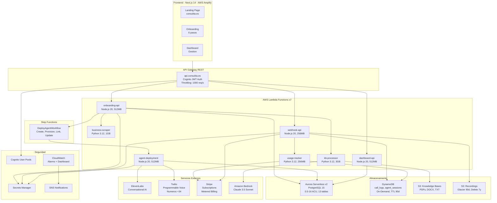
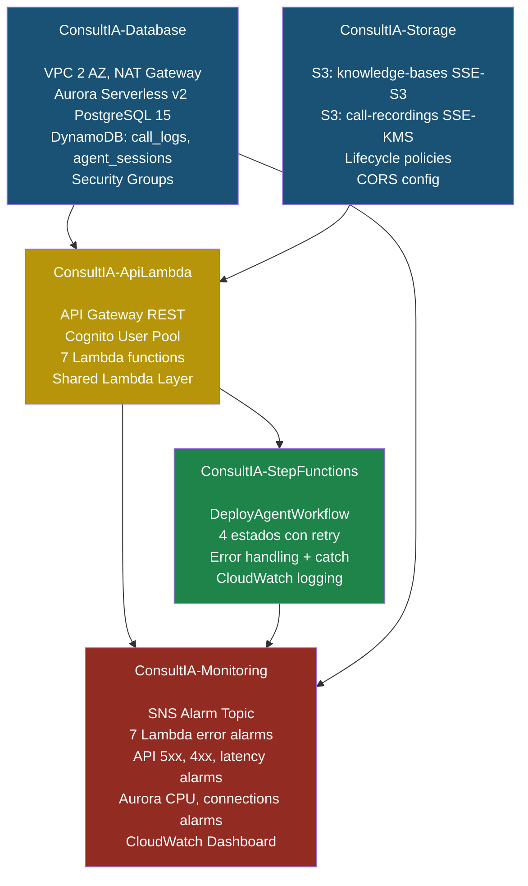
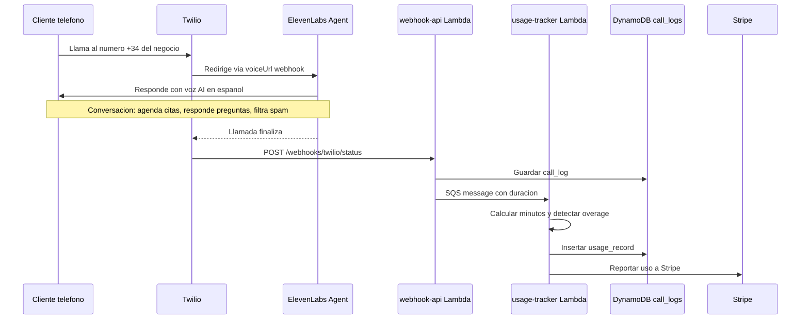

# ConsultIA - Recepcionista AI para PYMEs

Plataforma SaaS que permite a PYMEs espanolas (clinicas dentales, restaurantes, despachos de abogados, veterinarias, etc.) crear agentes de voz AI que atienden llamadas telefonicas 24/7, agendan citas y filtran spam. Usa ElevenLabs Conversational AI para la voz, Twilio para la telefonia y Stripe para la facturacion.

---

## Tabla de Contenidos

- [Arquitectura del Sistema](#arquitectura-del-sistema)
- [Stacks de Infraestructura (CDK)](#stacks-de-infraestructura-cdk)
- [Flujo de una Llamada](#flujo-de-una-llamada)
- [Estructura del Proyecto](#estructura-del-proyecto)
- [Stack Tecnologico](#stack-tecnologico)
- [Configuracion Local](#configuracion-local)
- [Despliegue en AWS](#despliegue-en-aws)
- [Endpoints de la API](#endpoints-de-la-api)
- [Variables de Entorno](#variables-de-entorno)

---

## Arquitectura del Sistema



---

## Stacks de Infraestructura (CDK)

El proyecto usa AWS CDK (TypeScript) con 5 stacks desplegados en orden de dependencia:



### Orden de despliegue

1. **ConsultIA-Database** - VPC, Aurora PostgreSQL, DynamoDB
2. **ConsultIA-Storage** - Buckets S3
3. **ConsultIA-ApiLambda** - API Gateway, Cognito, 7 Lambdas
4. **ConsultIA-StepFunctions** - Workflow de despliegue de agentes
5. **ConsultIA-Monitoring** - Alarmas CloudWatch, Dashboard, SNS

---

## Flujo de una Llamada



---

## Estructura del Proyecto

```
nuevo-proyecto/
|
|-- frontend/                          # Next.js 14 (App Router)
|   |-- app/
|   |   |-- layout.tsx                 # Layout principal con fonts
|   |   |-- page.tsx                   # Home page
|   |   |-- error.tsx                  # Error boundary
|   |   |-- not-found.tsx              # Pagina 404
|   |   |-- pricing/page.tsx           # Planes y precios
|   |   |-- industries/
|   |   |   |-- page.tsx               # Directorio de industrias
|   |   |   |-- [slug]/page.tsx        # Pagina por industria (x8)
|   |   |-- enterprise/page.tsx        # Solucion empresarial
|   |   |-- blog/page.tsx              # Blog
|   |   |-- onboarding/
|   |   |   |-- layout.tsx             # OnboardingProvider
|   |   |   |-- page.tsx               # Flujo de 6 pasos
|   |   |-- dashboard/[customerId]/
|   |       |-- layout.tsx             # Layout del dashboard
|   |       |-- page.tsx               # Overview
|   |       |-- calls/page.tsx         # Historial de llamadas
|   |       |-- agent/page.tsx         # Configuracion del agente
|   |       |-- billing/page.tsx       # Facturacion
|   |-- components/
|   |   |-- Navigation.tsx             # Header + menu movil
|   |   |-- Hero.tsx                   # Hero animado
|   |   |-- Features.tsx               # Grid de 8 features
|   |   |-- Pricing.tsx                # 3 planes de precios
|   |   |-- FAQ.tsx                    # Accordion de FAQs
|   |   |-- Footer.tsx                 # Footer
|   |   |-- onboarding/
|   |       |-- Stepper.tsx            # Progreso visual
|   |       |-- Step1BusinessInfo.tsx   # URL del negocio
|   |       |-- Step2ConfirmBusiness.tsx # Confirmar datos scrapeados
|   |       |-- Step3SelectVoice.tsx    # Galeria de voces
|   |       |-- Step4KnowledgeBase.tsx  # Subir documentos
|   |       |-- Step5TestAgent.tsx      # Desplegar + llamada de prueba
|   |       |-- Step6Payment.tsx        # Pago con Stripe
|   |-- lib/
|   |   |-- api.ts                     # Fetch wrapper
|   |   |-- industries.ts             # Datos de 8 industrias
|   |   |-- blog-posts.ts             # Articulos de ejemplo
|   |   |-- onboarding-context.tsx     # Estado del onboarding (sessionStorage)
|   |-- package.json
|   |-- tailwind.config.js
|   |-- tsconfig.json
|
|-- backend/
|   |-- infra/                         # AWS CDK (TypeScript)
|   |   |-- cdk-app.ts                # Entry point - 5 stacks
|   |   |-- package.json
|   |   |-- stacks/
|   |       |-- database-stack.ts      # VPC, Aurora, DynamoDB
|   |       |-- storage-stack.ts       # S3 buckets
|   |       |-- api-lambda-stack.ts    # API GW, Cognito, Lambdas
|   |       |-- api-stack.ts           # API GW + Cognito (standalone)
|   |       |-- step-functions-stack.ts # Workflow de despliegue
|   |       |-- monitoring-stack.ts    # CloudWatch, SNS
|   |
|   |-- lambdas/
|   |   |-- onboarding-api/            # Node.js 20.x - 7 route files
|   |   |   |-- src/
|   |   |       |-- index.ts
|   |   |       |-- routes/
|   |   |           |-- business-info.ts
|   |   |           |-- confirm-business.ts
|   |   |           |-- voice-selection.ts
|   |   |           |-- knowledge-base.ts
|   |   |           |-- agent-deployment.ts
|   |   |           |-- test-call.ts
|   |   |           |-- payment.ts
|   |   |
|   |   |-- dashboard-api/             # Node.js 20.x - 4 route files
|   |   |   |-- src/
|   |   |       |-- index.ts
|   |   |       |-- routes/
|   |   |           |-- overview.ts
|   |   |           |-- calls.ts
|   |   |           |-- agent-settings.ts
|   |   |           |-- billing.ts
|   |   |
|   |   |-- webhook-api/               # Node.js 20.x - Twilio + Stripe
|   |   |   |-- src/
|   |   |       |-- index.ts
|   |   |       |-- twilio/
|   |   |       |   |-- index.ts
|   |   |       |   |-- call-status.ts
|   |   |       |   |-- validate-signature.ts
|   |   |       |-- stripe/
|   |   |           |-- index.ts
|   |   |           |-- subscription-events.ts
|   |   |           |-- validate-signature.ts
|   |   |
|   |   |-- agent-deployment/          # Node.js 20.x - 4 Step Functions tasks
|   |   |   |-- src/
|   |   |       |-- index.ts
|   |   |       |-- create-agent.ts
|   |   |       |-- provision-number.ts
|   |   |       |-- link-number.ts
|   |   |       |-- update-database.ts
|   |   |
|   |   |-- business-scraper/          # Python 3.12 - LLM-first scraping
|   |   |   |-- lambda_function.py
|   |   |   |-- requirements.txt
|   |   |
|   |   |-- knowledge-base-processor/  # Python 3.12 - PDF/DOCX + Bedrock
|   |   |   |-- lambda_function.py
|   |   |   |-- requirements.txt
|   |   |
|   |   |-- usage-tracker/             # Python 3.12 - Minutos + Stripe
|   |   |   |-- lambda_function.py
|   |   |
|   |-- shared/                        # Capa compartida Lambda
|   |   |-- nodejs/
|   |       |-- src/
|   |       |   |-- index.ts           # Re-exports
|   |       |   |-- database.ts        # Pool PostgreSQL
|   |       |   |-- secrets.ts         # Secrets Manager client
|   |       |   |-- validation.ts      # Input validation
|   |       |   |-- retry.ts           # withRetry() exponential backoff
|   |       |   |-- response.ts        # CORS, parseBody, logRequest
|   |       |   |-- utilities.ts       # Utilidades varias
|   |       |   |-- types.ts           # Tipos TypeScript compartidos
|   |       |-- package.json
|   |       |-- tsconfig.json
|   |
|   |-- api-spec/
|       |-- openapi.yaml               # OpenAPI 3.0 spec completa
|
|-- planning/
|   |-- prd.json                       # 38 items del PRD (100% completado)
|   |-- deliverable.md                 # Documentacion del proyecto
|   |-- PLAN_NEGOCIO_CONSULTIA.md      # Plan de negocio
|
|-- scripts/
|   |-- deploy.sh                      # Script de despliegue a produccion
|
|-- .env.production.example            # Plantilla de variables de entorno
|-- CLAUDE.md                          # Instrucciones del proyecto
|-- README.md                          # Este archivo
```

---

## Stack Tecnologico

### Frontend

| Tecnologia | Version | Uso |
|------------|---------|-----|
| Next.js | 14 (App Router) | Framework React con SSG/SSR |
| TypeScript | 5.x | Tipado estatico |
| Tailwind CSS | 4.x | Estilos utility-first, tema oscuro |
| Framer Motion | - | Animaciones y transiciones |
| Headless UI | - | Componentes accesibles (dropdowns, accordions) |
| Heroicons | v2 | Iconografia |

### Backend - Lambda Functions

| Lambda | Runtime | Memoria | Timeout | Descripcion |
|--------|---------|---------|---------|-------------|
| onboarding-api | Node.js 20.x | 512 MB | 30s | Endpoints del flujo de onboarding |
| dashboard-api | Node.js 20.x | 512 MB | 30s | Endpoints del dashboard |
| webhook-api | Node.js 20.x | 256 MB | 30s | Webhooks unificado Twilio + Stripe |
| agent-deployment | Node.js 20.x | 512 MB | 60s | 4 tareas de Step Functions |
| business-scraper | Python 3.12 | 1 GB | 60s | Scraping web + LLM extraction |
| knowledge-base-processor | Python 3.12 | 3 GB | 15min | Extraccion PDF/DOCX + Bedrock |
| usage-tracker | Python 3.12 | 256 MB | 15s | Tracking de minutos (SQS trigger) |

### Infraestructura AWS

| Servicio | Configuracion |
|----------|---------------|
| **API Gateway** | REST API, throttling 1000 req/s, burst 2000 |
| **Cognito** | User Pool con email verification, atributos custom |
| **Aurora Serverless v2** | PostgreSQL 15, 0.5-16 ACU, 13 tablas, multi-AZ |
| **DynamoDB** | On-demand, 2 tablas (call_logs, agent_sessions), TTL |
| **S3** | 2 buckets (knowledge-bases SSE-S3, recordings SSE-KMS) |
| **Step Functions** | Workflow de 4 estados con retry y error handling |
| **CloudWatch** | Dashboard, 12+ alarmas, Log Groups |
| **SNS** | Topic para notificaciones de alarmas |
| **Secrets Manager** | Credenciales DB + API keys externas |
| **Route 53** | Dominio api.consultia.es con ACM TLS |

### Servicios Externos

| Servicio | Uso |
|----------|-----|
| **ElevenLabs** | Conversational AI - creacion de agentes de voz |
| **Twilio** | Programmable Voice - numeros +34, llamadas, grabaciones |
| **Stripe** | Subscriptions + Metered Billing (3 planes) |
| **Amazon Bedrock** | Claude 3.5 Sonnet - extraccion de conocimiento de PDFs |

### Base de Datos - Esquema PostgreSQL (13 tablas)

```
enterprises (1) --> customers (N) --> agents (1)
                                 --> knowledge_bases (1) --> kb_sources (N)
                                 --> phone_numbers (N)
                                 --> subscriptions (1) --> usage_records (N)
                                 --> test_calls (N)
                                 --> business_info (1)
```

### DynamoDB

| Tabla | Partition Key | Sort Key | TTL | GSIs |
|-------|--------------|----------|-----|------|
| consultia-call-logs | customer_id (S) | call_timestamp (N) | 90 dias | agent_id-index, call_sid-index |
| consultia-agent-sessions | agent_id (S) | session_timestamp (N) | si | customer_id-index |

---

## Configuracion Local

### Prerrequisitos

- **Node.js** >= 20.x
- **Python** >= 3.12
- **npm** >= 10.x
- **AWS CLI** v2 (configurado con credenciales)
- **AWS CDK CLI** (`npm install -g aws-cdk`)
- **Git**

### 1. Clonar el repositorio

```bash
git clone <repo-url>
cd nuevo-proyecto
```

### 2. Instalar dependencias del frontend

```bash
cd frontend
npm install
```

### 3. Instalar dependencias del backend

```bash
# Capa compartida
cd backend/shared/nodejs
npm install
npm run build

# Lambdas Node.js (webhook-api unifica Twilio + Stripe)
cd ../../lambdas/onboarding-api && npm install && npm run build
cd ../dashboard-api && npm install && npm run build
cd ../webhook-api && npm install && npm run build
cd ../agent-deployment && npm install && npm run build

# Lambdas Python
cd ../knowledge-base-processor && pip install -r requirements.txt
cd ../business-scraper && pip install -r requirements.txt
```

### 4. Instalar dependencias de CDK

```bash
cd backend/infra
npm install
```

### 5. Configurar variables de entorno

```bash
# Frontend
cp .env.production.example .env.local
# Editar .env.local con tus valores:
#   NEXT_PUBLIC_API_URL=http://localhost:4000  (o tu API Gateway local)
#   NEXT_PUBLIC_COGNITO_USER_POOL_ID=...
#   NEXT_PUBLIC_COGNITO_CLIENT_ID=...
#   NEXT_PUBLIC_STRIPE_PUBLISHABLE_KEY=pk_test_...
```

### 6. Ejecutar frontend en modo desarrollo

```bash
cd frontend
npm run dev
# Disponible en http://localhost:3000
```

### 7. Configurar secretos en AWS Secrets Manager

Antes de desplegar, crea los secretos necesarios:

```bash
# Credenciales de base de datos (se crea automaticamente via CDK)
# consultia/database/credentials

# API keys de servicios externos
aws secretsmanager create-secret \
  --name "consultia/production/api-keys" \
  --region eu-west-1 \
  --secret-string '{
    "ELEVENLABS_API_KEY": "...",
    "TWILIO_ACCOUNT_SID": "...",
    "TWILIO_AUTH_TOKEN": "...",
    "STRIPE_SECRET_KEY": "sk_test_...",
    "STRIPE_WEBHOOK_SECRET": "whsec_..."
  }'
```

---

## Despliegue en AWS

### Despliegue automatico (recomendado)

El script `scripts/deploy.sh` ejecuta todas las verificaciones y despliega los 5 stacks en orden:

```bash
# Despliegue completo
./scripts/deploy.sh

# Solo ver cambios (dry run)
./scripts/deploy.sh --dry-run

# Saltar build de Lambdas (solo cambios de infra)
./scripts/deploy.sh --skip-build
```

El script realiza las siguientes verificaciones antes de desplegar:
1. Herramientas instaladas (node, npm, npx, aws)
2. Credenciales AWS configuradas
3. Secretos requeridos en Secrets Manager
4. Build de todas las Lambdas (Node.js + Python)
5. CDK bootstrap si es necesario

### Despliegue manual con CDK

```bash
cd backend/infra

# Ver cambios pendientes
npx cdk diff

# Bootstrap (solo la primera vez)
npx cdk bootstrap aws://ACCOUNT_ID/eu-west-1

# Desplegar todos los stacks en orden
npx cdk deploy ConsultIA-Database
npx cdk deploy ConsultIA-Storage
npx cdk deploy ConsultIA-ApiLambda
npx cdk deploy ConsultIA-StepFunctions
npx cdk deploy ConsultIA-Monitoring

# O desplegar todo de una vez
npx cdk deploy --all --require-approval broadening
```

### Post-despliegue

```bash
# Suscribirse a alarmas
aws sns subscribe \
  --topic-arn <AlarmTopicArn> \
  --protocol email \
  --notification-endpoint tu@email.com

# Verificar API
curl https://api.consultia.es/plans

# Ver dashboard de CloudWatch
# https://eu-west-1.console.aws.amazon.com/cloudwatch/home?region=eu-west-1#dashboards:name=ConsultIA-Production
```

---

## Endpoints de la API

Base URL: `https://api.consultia.es`

La especificacion OpenAPI completa esta en `backend/api-spec/openapi.yaml`.

### Endpoints Publicos (sin autenticacion)

| Metodo | Ruta | Descripcion |
|--------|------|-------------|
| GET | `/voices` | Catalogo de voces ElevenLabs |
| GET | `/plans` | Planes de suscripcion disponibles |

### Onboarding API

| Metodo | Ruta | Paso | Descripcion |
|--------|------|------|-------------|
| POST | `/onboarding/business-info` | 1 | Enviar URL del negocio para scraping |
| GET | `/onboarding/{customerId}/business-status` | 1 | Estado del scraping |
| POST | `/onboarding/{customerId}/confirm-business` | 2 | Confirmar/editar datos del negocio |
| POST | `/onboarding/{customerId}/select-voice` | 3 | Seleccionar voz del agente |
| POST | `/onboarding/{customerId}/knowledge-base/upload` | 4a | Subir archivos PDF/DOCX/TXT |
| POST | `/onboarding/{customerId}/knowledge-base/text` | 4b | Anadir texto manualmente |
| GET | `/onboarding/{customerId}/knowledge-base/status` | 4 | Estado del procesamiento |
| POST | `/onboarding/{customerId}/deploy-agent` | 5a | Desplegar agente (ElevenLabs + Twilio) |
| GET | `/onboarding/{customerId}/deploy-status` | 5 | Estado del despliegue |
| POST | `/onboarding/{customerId}/test-call` | 5b | Iniciar llamada de prueba |
| GET | `/onboarding/{customerId}/test-call/{callSid}/status` | 5 | Estado de la llamada de prueba |
| POST | `/onboarding/{customerId}/select-plan` | 6a | Seleccionar plan |
| POST | `/onboarding/{customerId}/create-checkout` | 6b | Crear sesion Stripe Checkout |
| POST | `/onboarding/{customerId}/complete-payment` | 6c | Completar pago (webhook fallback) |

### Dashboard API (requiere Cognito JWT)

| Metodo | Ruta | Descripcion |
|--------|------|-------------|
| GET | `/dashboard/{customerId}/overview` | Vista general: agente, uso, suscripcion |
| GET | `/dashboard/{customerId}/calls` | Historial de llamadas paginado |
| GET | `/dashboard/{customerId}/agent` | Configuracion del agente |
| PATCH | `/dashboard/{customerId}/agent` | Actualizar nombre, prompt, voz |
| POST | `/dashboard/{customerId}/agent/pause` | Pausar agente |
| POST | `/dashboard/{customerId}/agent/resume` | Reanudar agente |
| GET | `/dashboard/{customerId}/billing` | Facturacion, uso, facturas Stripe |

### Webhooks (validacion de firma, sin auth JWT)

| Metodo | Ruta | Descripcion |
|--------|------|-------------|
| POST | `/webhooks/twilio/voice` | Webhook de voz Twilio (TwiML) |
| POST | `/webhooks/twilio/status` | Estado de llamadas Twilio |
| POST | `/webhooks/stripe` | Eventos de Stripe (checkout, invoices, subscriptions) |

---

## Variables de Entorno

### Frontend (Next.js)

| Variable | Descripcion | Ejemplo |
|----------|-------------|---------|
| `NEXT_PUBLIC_API_URL` | URL base de la API | `https://api.consultia.es` |
| `NEXT_PUBLIC_COGNITO_USER_POOL_ID` | ID del User Pool de Cognito | `eu-west-1_XXXXXXXXX` |
| `NEXT_PUBLIC_COGNITO_CLIENT_ID` | ID del cliente de Cognito | `xxxxxxxxxxxxxxxxxxxxxxxxxx` |
| `NEXT_PUBLIC_STRIPE_PUBLISHABLE_KEY` | Clave publica de Stripe | `pk_live_...` |

### Backend (CDK / Lambda)

| Variable | Descripcion | Ejemplo |
|----------|-------------|---------|
| `CDK_DEFAULT_ACCOUNT` | ID de cuenta AWS | `123456789012` |
| `CDK_DEFAULT_REGION` | Region AWS | `eu-west-1` |
| `ENV` | Entorno de despliegue | `production` |
| `FRONTEND_URL` | URL del frontend (CORS) | `https://master.d3y5kfh3d0f62.amplifyapp.com` |

### Secrets Manager

Los secretos sensibles se almacenan en AWS Secrets Manager, nunca como variables de entorno:

| Secreto | Contenido |
|---------|-----------|
| `consultia/database/credentials` | Username y password de Aurora PostgreSQL (generado automaticamente por CDK) |
| `consultia/production/api-keys` | JSON con: `ELEVENLABS_API_KEY`, `TWILIO_ACCOUNT_SID`, `TWILIO_AUTH_TOKEN`, `STRIPE_SECRET_KEY`, `STRIPE_WEBHOOK_SECRET` |

---

## Planes de Suscripcion

| Plan | Precio Mensual | Minutos Incluidos | Overage |
|------|---------------|-------------------|---------|
| Starter | 29 EUR/mes | 150 minutos | 0.15 EUR/min |
| Professional | 79 EUR/mes | 300 minutos | 0.15 EUR/min |
| Enterprise | 199 EUR/mes | 750 minutos | 0.15 EUR/min |

Todos los planes incluyen 14 dias de prueba gratis y facturacion mensual o anual.

---

## Seguridad y Cumplimiento

- **RGPD/GDPR**: Todos los datos en `eu-west-1` (Irlanda, UE)
- **Cifrado**: At-rest (AES-256 / KMS) y en transito (TLS 1.2+)
- **Validacion de input**: UUID, telefono E.164, strings, XSS sanitization
- **SSRF Protection**: Validacion de URLs en business-scraper (bloqueo de IPs privadas)
- **IDOR Protection**: Verificacion de JWT ownership en dashboard-api
- **Error Masking**: Respuestas 500 genericas sin stack traces
- **Secrets**: AWS Secrets Manager (nunca plaintext en env vars)
- **Retention**: Grabaciones 7 anos, call logs 90 dias (TTL automatico)

---

## Licencia

Proyecto privado. Todos los derechos reservados.
